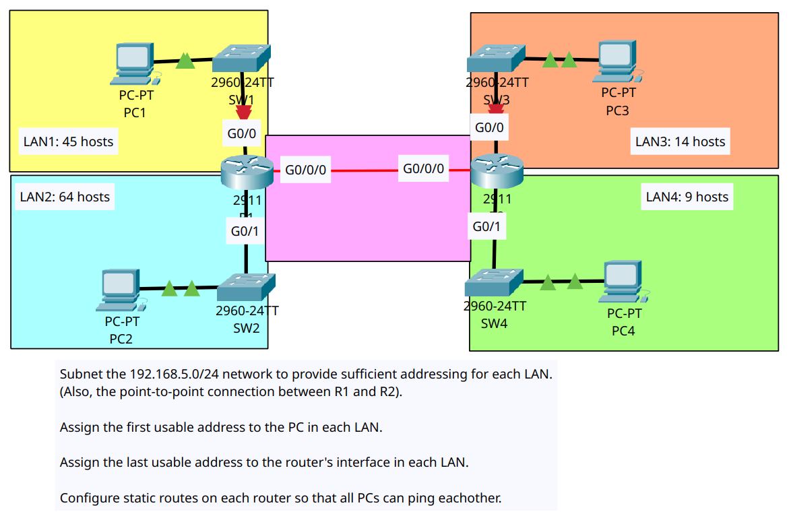
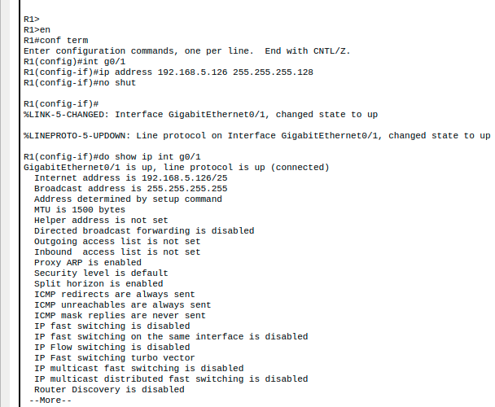
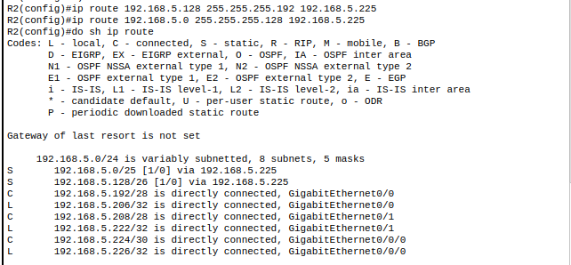

# Lab 15 - VLSM subnetting

## Goal
Subnet the 192.168.6.0/24 network to provide sufficient addressing for each LAN. (also, the point-to-point connection between R1 and R2).
Assign the first usable address to the PC in each LAN.
Assign the last usable address to the router's interface in each LAN.
Configure the static routes on each router so that the PCs can ping each other.

## Screenshots

### Topology

### Router Configuration

